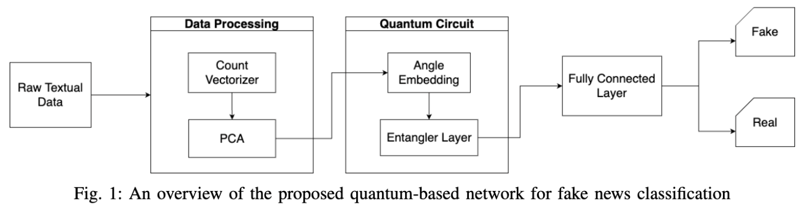

# Fake News Detection Using a Quantum Machine Learning Approach

## Overview
We are excited to present a project that leverages quantum computing and machine learning to detect fake news effectively. This project has been recognized and accepted at the CISS 2025 conference.




## Installation & Usage

To get started with this project, clone the repository and install the required dependencies:

```bash
git clone https://github.com/ajam74001/FakeNews-Detection_Quantum-ML-Approach.git
```
```
cd FakeNews-Detection_Quantum-ML-Approach
```

Run the model using the following command:
```
python main.py
```


## Citation
If you use this project or its findings, please cite it as follows:

```
@inproceedings{fakenewsdetection2025,
  title={Fake News Detection Using a Quantum Machine Learning Approach},
  author={Ainaz Jamshidi, Muhammad Arif},
  booktitle={Proceedings of the CISS 2025},
  year={2025}
}
```

## Contact
For any inquiries, please reach out via email at ainazj1@umbc.edu.
