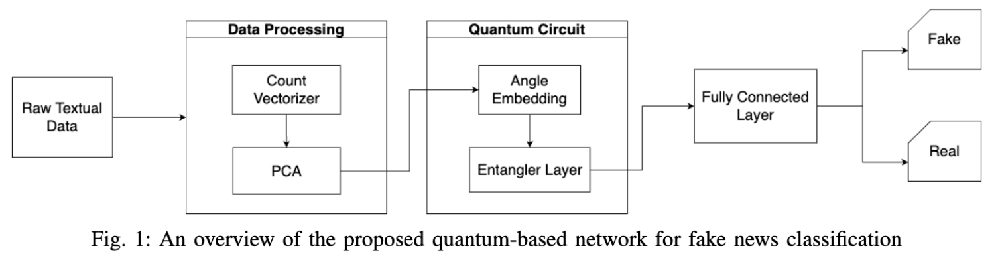

# Fake News Detection Using a Quantum Machine Learning Approach

## Overview
We are excited to present a project that leverages quantum computing and machine learning to detect fake news effectively. This project has been recognized and accepted at the CISS 2025 conference.




## Installation & Usage

To get started with this project, clone the repository and install the required dependencies:

```bash
git clone https://github.com/ajam74001/FakeNews-Detection_Quantum-ML-Approach.git
```
```
cd FakeNews-Detection_Quantum-ML-Approach
```

Run the model using the following command:
```
python main.py
```


## Citation
If you use this project or its findings, please cite it as follows:

```
@INPROCEEDINGS{10944642,
  author={Jamshidi, Ainaz and Arif, Muhammad},
  booktitle={2025 59th Annual Conference on Information Sciences and Systems (CISS)}, 
  title={Revolutionizing Fake News Detection: A Quantum Machine Learning Paradigm}, 
  year={2025},
  volume={},
  number={},
  pages={1-3},
  keywords={Social networking (online);Quantum entanglement;Open Access;Computational modeling;Decision making;Machine learning;Feature extraction;Fake news;Integrated circuit modeling;Quantum circuit;quantum computing;fake news detection;quantum artificial neural network},
  doi={10.1109/CISS64860.2025.10944642}}
```

## Contact
For any inquiries, please reach out via email at ainazj1@umbc.edu.
